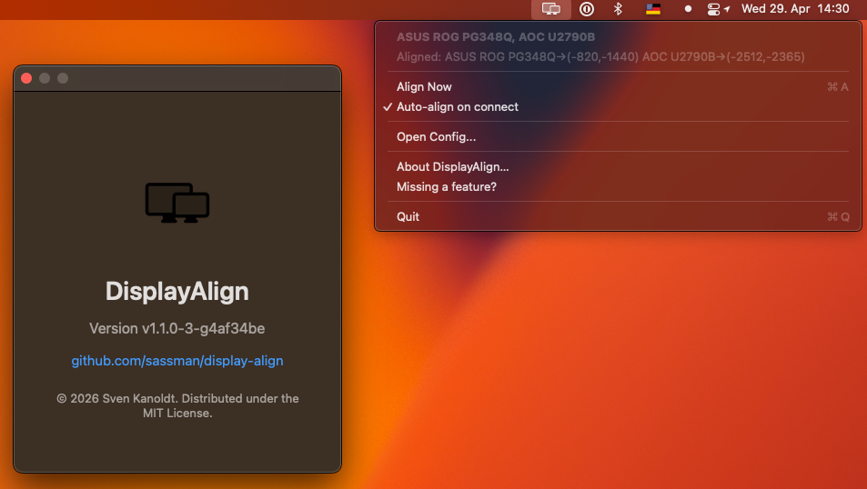
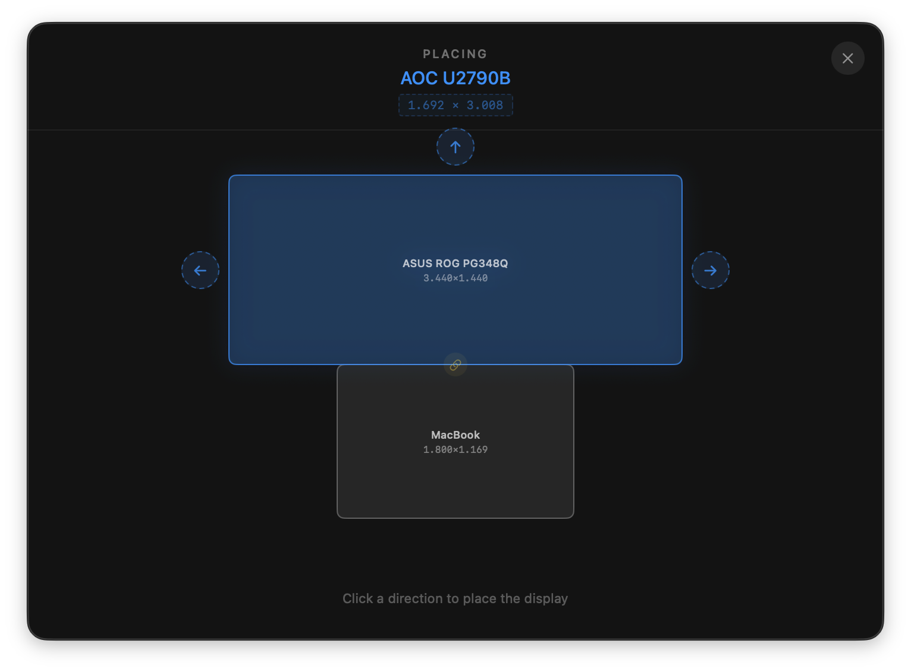
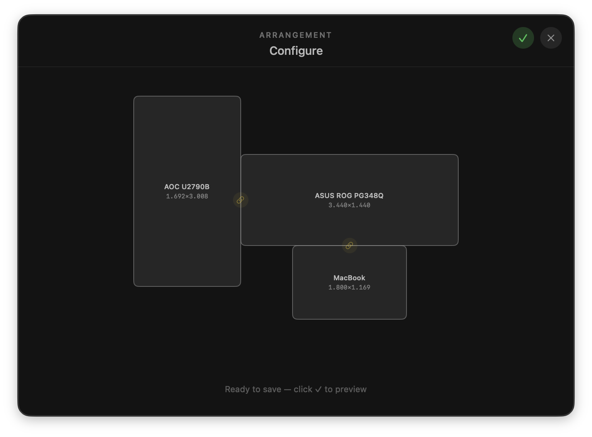
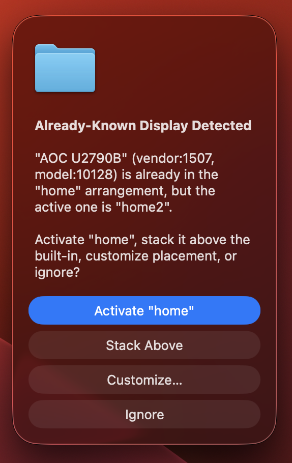

# DisplayAlign



macOS arranges displays well enough — until you need pixel precision, use the same monitors at different desks, or get tired of dragging rectangles in System Settings every time something changes. The built-in UI has no pixel-level control, no saved layouts, and no quick switching.

DisplayAlign fixes that. A native macOS menubar app (pure CoreGraphics, no dependencies) that gives you:

- **Pixel-precise positioning** — visual editor or config file, down to the exact pixel
- **Named arrangements** (office / home / travel) — switch in one click from the menubar
- **Auto-applies on connect** — displays land where they belong without opening System Settings
- **Visual editor** for placing and fine-tuning displays relative to each other
- **Config file** for full programmatic control when you prefer it

<p align="center">
  
</p>

## Install

```sh
brew install --cask sassman/tap/display-align
```

Or build from source:

```sh
./bundle.sh
# Installs to ~/Applications/DisplayAlign.app
```

Add to Login Items (System Settings → General → Login Items) for auto-start.

## Visual Editor

When a new display connects that isn't in any arrangement, the app opens a visual placement editor instead of requiring manual JSON editing.

1. **Select anchor** — tap an existing display to use as reference point
2. **Choose direction** — arrows appear; pick where to place the new display
3. **Fine-tune** — drag to adjust offset, pick alignment (top/center/bottom or left/center/right)
4. **Preview & confirm** — the arrangement applies live with a countdown; tap anywhere to revert

Tap any placed display to adjust it again. Unchain (unlink) a display to reposition it from scratch.

<p align="center">
  
  <br><em>Place a new display against an edge of an existing one.</em>
</p>
<p align="center">
  
  <br><em>Fine-tune position and alignment.</em>
</p>
<p align="center">
  
  <br><em>Preview arrangement before saving changes.</em>
</p>

## Config

<details>
<summary><code>~/.config/display-align/config.json</code> — full reference</summary>

On first run, the config is seeded with a `default` arrangement and one stacked display. The app reads the file on startup and whenever displays change; edit it to change behavior.

```json
{
  "active": "default",
  "ignored": [],
  "arrangements": [
    {
      "name": "default",
      "stacked": [
        { "name": "DELL P3424WEB", "vendor": 4268, "model": 17092 }
      ],
      "flexible": []
    }
  ]
}
```

| Field | Scope | Meaning |
|-------|-------|---------|
| `active` | top-level | The arrangement currently in effect. The menubar's **Active Arrangement** submenu switches it; the value is persisted across launches. |
| `ignored` | top-level (global) | Displays the app will never move or prompt about. Global because "leave this dongle alone" doesn't change between desks. |
| `arrangements` | top-level | List of named layouts. Always non-empty; falls back to `default` if `active` doesn't resolve. |
| `arrangements[].name` | per-arrangement | Speaking name shown in the menu (e.g. `"office"`, `"home"`, `"travel"`). |
| `arrangements[].stacked` | per-arrangement | Displays centered above the built-in screen. |
| `arrangements[].flexible` | per-arrangement | Displays positioned relative to another (see below). |

### Arrangements (multiple desks / setups)

Each arrangement is an independent layout. Switch from the menubar in one click. Handy when the same monitors sit in different positions at different desks. The active arrangement is saved in `active`, so the app starts in whatever setup you left it.

```json
{
  "active": "office",
  "ignored": [],
  "arrangements": [
    {
      "name": "default",
      "stacked": [
        { "name": "DELL P3424WEB", "vendor": 4268, "model": 17092 }
      ],
      "flexible": []
    },
    {
      "name": "office",
      "stacked": [
        { "name": "ASUS ROG PG348Q", "vendor": 1129, "model": 13363 }
      ],
      "flexible": [
        {
          "name": "AOC U2790B", "vendor": 1507, "model": 10128,
          "position": "left", "relative_to": "ASUS ROG PG348Q",
          "align": "top", "offset": -925, "rotation": 90
        }
      ]
    }
  ]
}
```

When more than one arrangement is defined, the menubar shows an **Active Arrangement: \<name\> ▸** submenu. Pick another and the layout re-evaluates (and re-aligns, if *Auto-align on connect* is on).

### Stacked (simple)

Displays in `stacked` are centered above the built-in MacBook screen. No further configuration needed.

```
       ┌──────────────────┐
       │  DELL P3424WEB   │
       └──────────────────┘
            ┌────────┐
            │MacBook │
            └────────┘
```

### Flexible (relative positioning)

Displays in `flexible` are placed relative to another display with pixel-precise offset tuning.

| Field | Values | Meaning |
|-------|--------|---------|
| `position` | `above`, `below`, `left`, `right` | Which side of the reference display |
| `relative_to` | `"builtin"` or a display name | The anchor display (must exist in the same arrangement, or be `"builtin"`) |
| `align` | `top`, `center`, `bottom` | Which edge of `relative_to` to align against |
| `offset` | integer (pixels) | Shift from the `align` anchor. Positive = down (for left/right) or right (for above/below) |
| `rotation` | `0`, `90`, `270` | Informational (set rotation via System Settings) |

#### Example: portrait monitor left of a stacked ultrawide

```json
{
  "name": "default",
  "stacked": [
    { "name": "DELL P3424WEB", "vendor": 4268, "model": 17092 }
  ],
  "flexible": [
    {
      "name": "LG 27UP850", "vendor": 220, "model": 5531,
      "position": "left",
      "relative_to": "DELL P3424WEB",
      "align": "top",
      "offset": 120,
      "rotation": 90
    }
  ]
}
```

The LG sits to the left of the Dell with its top edge 120px below the Dell's top:

```
        DELL P3424WEB (relative_to)
        ┌──────────────────┐  ← align: "top" (offset: 0 would start here)
        │                  │
        │                  │  ← offset: 120 (LG top starts here)
  ┌───┐ │                  │
  │   │ │                  │
  │ L │ │                  │
  │ G │ └──────────────────┘
  │   │      ┌────────┐
  └───┘      │MacBook │
             └────────┘
```

The mouse crosses horizontally between the Dell and the LG without jumping vertically. Tune `offset` until the crossing feels right.

### Ignored (global)

Displays in `ignored` are left alone in every arrangement. The app won't move them or prompt about them. Good fit for hardware that shouldn't participate at all: a capture dongle, a media-playback TV.

### Migration from older configs

Configs that predate the `active` / `arrangements` schema (top-level `stacked` / `flexible`) get wrapped into a single `default` arrangement on first launch. `ignored` stays at the top level. The migration runs once and rewrites the file in place; no manual editing required.

</details>

## Unknown displays

When a display connects that isn't in the active arrangement, you get a prompt. Buttons:

| Button | Effect |
|---|---|
| **Activate X** | If another arrangement already knows the display. Activate that arrangement. |
| **Stack Above** | Adds the display to `stacked`. Mutates the active arrangement if it's empty; otherwise clones the active arrangement. |
| **Customize...** | Opens the visual editor to flexible place the display anywhere. |
| **Ignore** | Adds to the global `ignored` list. |

<p align="center">
  
</p>

Edit `~/.config/display-align/config.json` directly to rename arrangements or customize by hand. The "Open Config..." menu item reveals the file in Finder.

Or, use the visual editor to customize arrangements, by use the "Configure Arrangement.." menu item.

## Build from source

Requires macOS 14+ and Swift 5.9+.

```sh
swift build -c release
./bundle.sh
```
